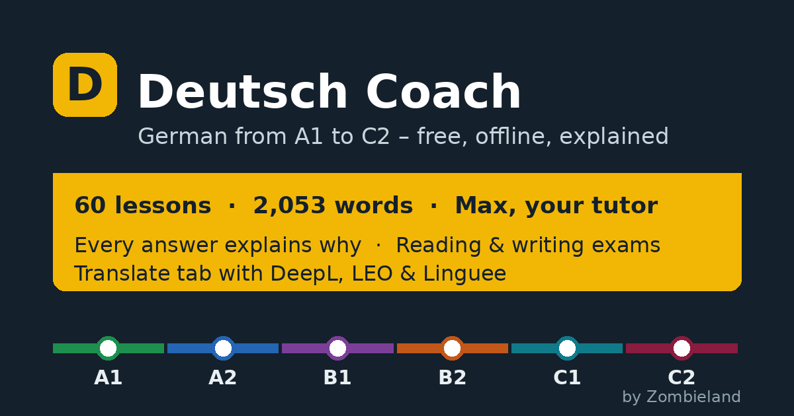

# Deutsch Coach

**Learn German from A1 to C2 — free, offline, and every answer explained.**
Created by **Zombieland** · version 5.0.0 · last updated 23 September 2026

**Open the app:** https://kamleshdeora6-prog.github.io/german-v2/



---

## What it is

A complete German course that runs in the browser, installs like an app, and works without internet after the first visit.

- **60 lessons** from A1 to C2, in a fixed order: A1 (1–12), A2 (13–24), B1 (25–42), B2 (43–50), C1 (51–56), C2 (57–60). Each lesson has five parts: *Learn* (rule, table, 10 examples with audio, vocabulary), *Read* (a text with tap-to-translate), *Practice* (10 exercises plus unlimited new ones), *Exam* (10 exam-style questions) and *Speak* (a picture, prompts, timer, speech recognition).
- **Practice that explains itself.** 53 generators build fresh sentences every time and say *why* the answer is right and *why* each wrong option is wrong. Word-order puzzles accept every correct German order and challenge you to find another.
- **1,995 words** with level and topic, learned with spaced repetition (flashcards that come back just before you forget them).
- **Max, the offline tutor.** Checks your sentences (word order, verb endings, cases after verbs, prepositions and possessives, articles, modal verbs, negation, capitalisation), explains grammar, conjugates verbs and quizzes you. He doesn't catch everything and says so. With your own Anthropic API key he can also answer open questions.
- **Translate tab.** Offline meanings, article and conjugation tables, word-by-word breakdowns and a grammar check — plus one-tap links to DeepL, Google Translate, Reverso, LEO, Linguee, dict.cc, Duden and Wiktionary.
- **Exam training.** Reading exam sets (A2–C1) with reasons for every answer, 10 writing tasks (A2–C2) with phrase banks, timer and model texts, a mock test, speaking practice and 183 *Leben in Deutschland* practice questions.
- **Learner profiles.** Several people can learn on one device, each with their own name and progress.
- **Placement test.** 96 items in 12 adaptive stages test rule knowledge, not typing speed, and give you a level, a sub-level and your weakest topics.
- **Learning plan.** A goal, a date, and one thing to do each day — with an honest verdict when the deadline can't work.
- **Practice day, weak topics and a refresher** for anyone coming back after a break.
- **Frau Weber**, the strict teacher's voice (switchable: streng / neutral / freundlich).
- **Pronunciation drills.** Eight sound pairs (ü/u, ö/o, ich/sch, long vs. short vowels, w/v, z/s …) with listening tests and a microphone check.
- **Report a problem.** Every question has a ⚑ button that opens a pre-filled report.

## Documentation

The [master report](docs/Deutsch_Coach_Master_Report.pdf) (80 pages) documents every grammar correction, the new grammar sheets, the complete A1–C2 word list and the development plan. In the app it is linked under **More → What's new** and **About & privacy**. The version history is in [CHANGELOG.md](CHANGELOG.md).

## Your data

Everything is stored on your device only — no accounts, ads, tracking or analytics. Clearing browser data deletes progress, so export a backup now and then (Settings → Export backup); the app reminds you monthly. Full details are in the app under **More → About & privacy**.

Deutsch Coach is an independent project and is not affiliated with the Goethe-Institut, telc, ÖSD or BAMF.

## Install

| Device | How |
|---|---|
| Android | Open the link in Chrome → ⋮ → *Install app*. Or install `dist/deutsch-coach.apk` (allow "install unknown apps"). |
| iPhone / iPad | Open the link in Safari → Share → *Add to Home Screen*. |
| Computer | Open the link in Chrome or Edge → install icon in the address bar. |

If lessons are silent, the device has no German voice installed — the app shows how to add one.

## Found a mistake?

Tap ⚑ on the question, or [open an issue](https://github.com/kamleshdeora6-prog/german-v2/issues). Please include the lesson and what you think is right.

---

## For developers

No build step and no dependencies: plain HTML, CSS and JavaScript.

```
index.html, sw.js, manifest.webmanifest   app shell, offline cache, install data
css/app.css                               all styles
js/core.js        storage (per-profile), spaced repetition, grading, speech
js/engine.js      sentence generator (tagged lexicon) — A1–B1 generators
js/engine_plus.js B2–C2 generators and the multi-order word-order builder
js/tutor.js       Max: sentence checker, dictionary, conjugation, rule cards, optional online AI
js/ui.js          question widget, audio buttons, umlaut bar, dictionary links, report button
js/views1-5.js    screens (home, lessons, practice, words, exams, translate, settings, about …)
js/app.js         router, profiles, onboarding, backup, report sheet
js/data/*.js      generated course data (don't edit by hand)
tools/            curriculum sources (tools/curriculum/*.txt) and build_data.py
android/          WebView wrapper (smali + Java reference) with native speech and links
ios/              WKWebView wrapper (Swift + XcodeGen spec), needs macOS to build
```

**Change the course:** edit `tools/curriculum/content_*.txt` (lessons) or `vocab_*.txt` (`word|meaning|plural|topic` under `#A1` … `#C2`), then run `python3 tools/build_data.py`.

**Run locally:** `python3 -m http.server` in the repo folder, then open http://localhost:8000.

**Publish:** Settings → Pages → Source: *GitHub Actions*. The `pages.yml` workflow deploys on every push to `main`.

**Tests:** `node tests/run.js` checks the course data, all generators and Max (corrections and false alarms); the *Tests* workflow runs it on every push.

**Android APK:** the *Build APK* workflow builds and signs it. Without a keystore it uses the public debug key (testing only). For releases, add the repository secrets `KEYSTORE_BASE64`, `KS_ALIAS` and `KS_PASS` (see the master report), or run `KEYSTORE=… KS_ALIAS=… KS_PASS=… bash build_apk.sh` locally (locally: download the two jars listed in `.github/workflows/build-apk.yml` into `tools/jars`, then `TOOLS=tools/jars bash build_apk.sh`; needs Java only, no Android SDK).

**Report address:** problem reports go to this repo's GitHub issues. To also offer email, set `App.contact.email` at the top of `js/app.js`.

**Link previews:** the Open Graph tags in `index.html` point to `https://kamleshdeora6-prog.github.io/german-v2/`. If the repo is renamed or a custom domain is used, update the three URLs there (`og:url`, `og:image`, `twitter:image`).

© 2026 Zombieland. All rights reserved.
